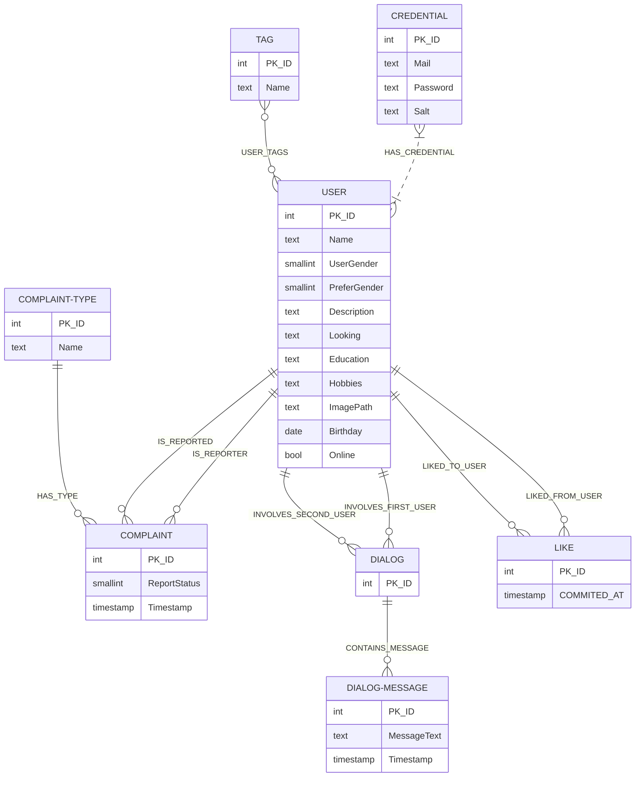

## Диаграммы

[ER диаграмма в draw.io](Umlaut.drawio)

Mermaid описание

## Описание таблиц

1. **Таблица "COMPLAINT" (Жалобы):**
    -  Эта таблица хранит информацию о жалобах, поданных пользователями. В ней фиксируются жалобы с указанием текста сообщения, времени подачи и связанных сущностей, таких как пользователь-жалующийся, пользователь-нарушитель и тип жалобы.

2. **Таблица "COMPLAINT-TYPE" (Типы жалоб):**
    -  Эта таблица содержит перечень различных типов жалоб, которые могут быть использованы в таблице "COMPLAINT" для классификации жалоб.

3. **Таблица "USER" (Пользователи):**
    -  Эта таблица содержит информацию о пользователях приложения. Здесь сохраняются данные о пользовательских профилях, включая имя, пол, возраст, интересы, теги, путь к изображению профиля, дату рождения и другие характеристики. В этой таблице хранятся учетные данные пользователей, включая адрес электронной почты (Mail), хэш пароля (Password) и соль (Salt).

4. **Таблица "DIALOG" (Диалоги):**
    -  Эта таблица предназначена для хранения информации о диалогах между пользователями. Здесь фиксируются идентификаторы диалогов, а также связи с пользователями.

5. **Таблица "MESSAGE" (Сообщения в диалогах):**
    -  В этой таблице хранятся сообщения, отправленные в диалогах между пользователями. Для каждого сообщения указывается текст сообщения, дата отправки и связь с соответствующим диалогом и отправителем.

6. **Таблица "LIKE" (Лайки):**
    -  Эта таблица используется для отслеживания действий "лайк" в приложении. Она включает в себя информацию о лайках, включая дату и связи с пользователями, которые поставили лайк и пользователями, которым поставили лайк.

7. **Таблица "Tag" (Теги):**
   -  Эта таблица хранит список тегов, которые могут быть привязаны к пользователям.

8. **Таблица "UserTag" (Теги пользователей):**
   -  Эта таблица представляет связь между пользователями и тегами. Она указывает, какие теги связаны с конкретными пользователями.

## Функциональные зависимости

**Relation "COMPLAINT" (Жалобы):**

{PK ID} -> {Message, ReportedID, ComplaintTypeID, Timestamp}

**Relation "USER" (Пользователи):**

{PK ID} -> {Name, UserGender, Looking, Hobbies, ImagePath, Birthday, Mail, Password, Salt}

{Mail} -> {Name, UserGender, Looking, Hobbies, ImagePath, Birthday, Password, Salt}

**Relation "COMPLAINT-TYPE" (Типы жалоб):**

{PK ID} -> {Name}

**Relation "DIALOG" (Диалоги):**

{PK ID} -> {FK_User1ID, FK_User2ID}

**Relation "MESSAGE" (Сообщения в диалогах):**

{PK ID} -> {Message Text, Date, FK_DialogID, FK_SenderID}

**Relation "LIKE" (Лайки):**

{PK ID} -> {Timestamp, FK_LikedFromUserID, FK_LikedToUserID}

**Relation "Tag" (Теги):**

{PK ID} -> {Name}

**Relation "UserTag" (Теги пользователей):**

{PK ID} -> {UsersID, TagID}
